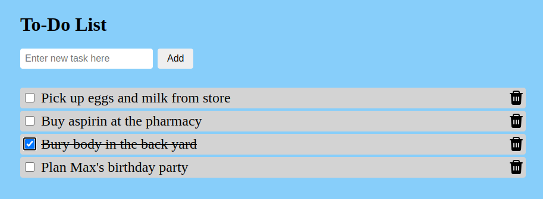

# Simple To-Do List

_Keep track of all of your important tasks. Just don't hit the refresh button!_

**Try the app live [here](https://et-codes.github.io/todo-app/).**

## Description

This is a simple task tracking app written with vanilla HTML, CSS, and JavaScript. It is a front-end demonstration only, so nothing is saved to a database or anything, hence my warning above not to hit the refresh button. Creating, updating, and displaying dynamic lists programmatically is important in many web applications, which is why building a simple app like this can be a valuable learning exercise.

Clicking the checkbox or the task text itself will check the box and apply ~~strike-through~~ styling to the text. Click it again to do the reverse. Click the trash can icon to remove an item from the list.

**Author:** Eric Thornton | [LinkedIn](https://www.linkedin.com/in/ethornton/)
